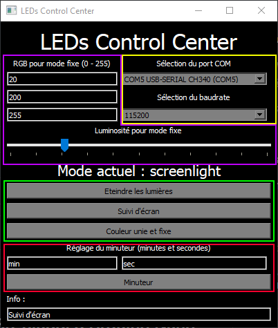

# LED's go
## Control LEDs behind your screen with a simple USB-plugged Arduino Nano 

Video: https://www.youtube.com/watch?v=ITaTlD44Gg0

## Hardware Installation
_Images to come..._

Hardware needed:
- Any WS2812b LED strip (and its power supply)
- One Arduino (Nano works fine)

Installation steps:
1. Plug the Arduino Nano to your computer (host PC) with USB.
2. Plug the Arduino ground PIN to the negative PIN of the powersupply (or to the ground of the LED strip).
3. Plug the Arduino data PIN (default is PIN D4) to the data PIN (middle one) of the WS2812b LED strip.

## Software Installation
### 1. _Set up the controller on host PC_
Project is made for Windows 10 with Python 3.9.7.
(See this tutorial to get Python for Windows 10: https://docs.microsoft.com/en-us/windows/python/beginners)

Install the Python libs listed in _requirements.txt_ file.

```sh
pip install -r requirements.txt
```

Run the .exe by double-clicking the _ihm/LEDs Control Center.exe_. Should work ¯\\_(ツ)_/¯

If you want to re-build the .exe (useful only if you modified the ihm.py), run the following:
```sh
pyinstaller.exe --onefile --windowed --icon misc\\icon.ico --name 'LEDs Control Center' ihm.py
```
(maybe the full path for pyinstaller.exe will be needed)
If you modify a Python script under the [scripts](ihm/scripts) folder, there is no need to re-build since the .exe calls these Python scripts avec Python.



**Purple** area is where you choose the RGB values for the unicolor mode.

**Yellow** area is where you can change COM port and baudrate. It should not be of great use once set in the [config file](ihm/scripts/default\_config.ini).

**Green** area are the buttons to use to change the lightning mode:

- _Eteindre les lumières_ sets all LEDs to black (= off).

- _Suivi d'écran_ is the dynamic lightning which set LEDs to screen colors.

- _Couleur unie et fixe_ sets all LEDs to the color defined in the **Purple** area.

**Red** area is where you set and start the timer mode. First box is for minutes. Second box is for seconds. Then click the _Minuteur_ button to start the timer.

Last text box (_Info_) displays some short - useless - info when clicking buttons.

### 2. _Configure the [config file](ihm/scripts/default\_config.ini)_
1. Choose what monitor will be used for the dynamic lightning effect. ([ECRAN] **Monitor**)
2. Set the width ([ECRAN] **LargeurEcran**) and the height ([ECRAN] **HauteurEcran**) of your screen in centimeters (edges NOT included).
3. Measure the positions of your LEDs with respect to the screen for each side (top, bottom, left, right), in centimeters. Note that the total number of LEDs here should match the N\_LEDS macro in the [Arduino code](arduino/screen\_to\_ledstrip\_fast/screen\_to\_ledstrip\_fast.ino).
    - **PositionLedsHaut** is for **top** side LEDs, from **left to right**. Each number is a LED distance to **top-left** corner.
    - **PositionLedsBas** is for **bottom** side LEDs, from **left to right**. Each number is a LED distance to **bottom-left** corner.
    - **PositionLedsGauche** is for **left** side LEDs, from **top to bottom**. Each number is a LED distance to **top-left** corner.
    - **PositionLedsDroite** is for **right** side LEDs, from **top to bottom**. Each number is a LED distance to **top-right** corner.
4. Set the starting corner (where power and Arduino are plugged to the strip) ([LEDS] **CoinDebutLeds**)
5. Set the strip direction (clockwise or counterclockwise), when you look at your screen and the LEDs are behind the screen. ([LEDS] **SensParcoursLEDs**)
6. [LEDS] **Luminosity** should be left at 100% by default. This parameter is set within the app.
7. [LIEN_SERIE] defines serial communication settings. It can be configured later within the app, except the **SerialTimeout**. Nevertheless, **Baudrate** is not expected to be changed. If the Arduino COM Port is always the same, you can set it there (**COMPort**).
8. You could change the lib used to screenshot the screen in dynamic lightning mode. MSS is the faster. Other options will probably be removed. Leave **MethodeScreenshot** to _mss_.
9. Finally you can change the pixels neighborhood used to compute each LED value in dynamic lightning mode.
    - **VoisinageHaut** is the neighborhood for top LEDs. **VoisinageBas** is for bottom LEDs.
        - [x,y] : x is the left/right neighborhood and y is the top/down one.
        - For example: [100,500] for VoisinageHaut, will use a 200x500 pixel rectangle.
    - **VoisinageGauche** is the neighborhood for left LEDs. **VoisinageDroite** is for right LEDs.
        - [x,y] : x is the left/right neighborhood and y is the top/down one.
        - For example: [100,500] for VoisinageGauche, will use a 100x1000 pixel rectangle.


### 3. _Set up the Arduino Nano - USB Plugged_
Open the [Arduino code](arduino/screen\_to\_ledstrip\_fast/screen\_to\_ledstrip\_fast.ino) with Arduino IDE (https://www.arduino.cc/en/software).
Download FastLED Arduino's library (go through this tuto and search for FastLED in the library manager: https://www.arduino.cc/en/guide/libraries)

Change the macros if needed (N\_LEDS and PIN). 
N\_LEDS is the number of LEDs you want to light up. It should match the LEDs you wrote in _ihm/scripts/default\_config.ini_.
PIN is the pinout of the Arduino, plugged into the LEDs strip control pin.

Compile and download the code to the Arduino.
Arduino has to remain USB-plugged to the computer in order to receive messages from the control center.

# Info and links

[FastLED](https://github.com/FastLED/FastLED) (Arduino library) GitHub.
[Icon](ihm/misc/icon.ico) under GNU General Public License.